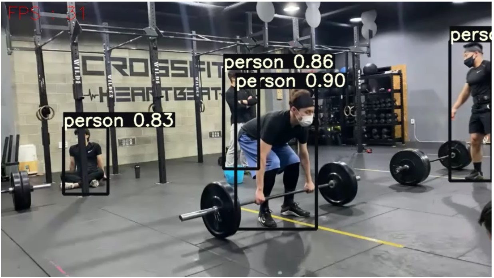
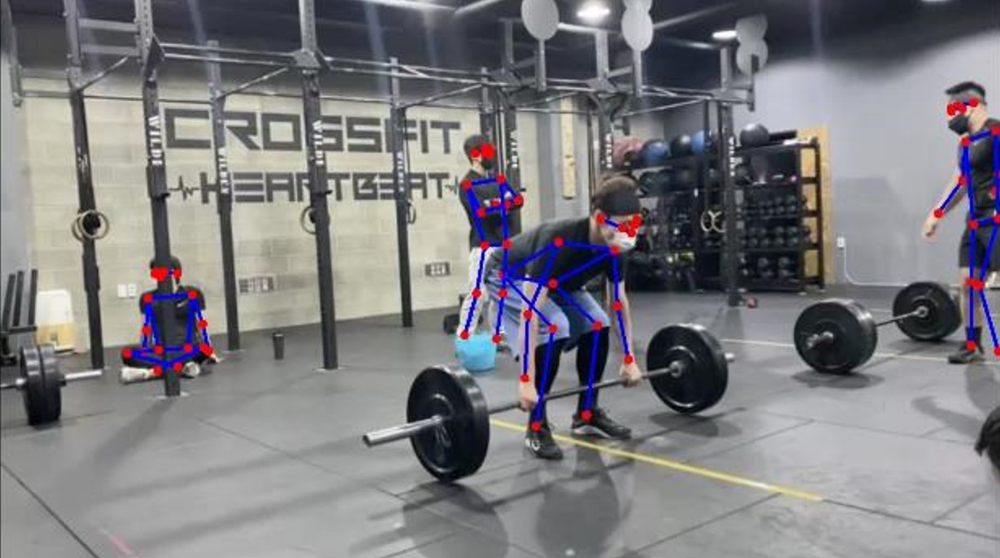
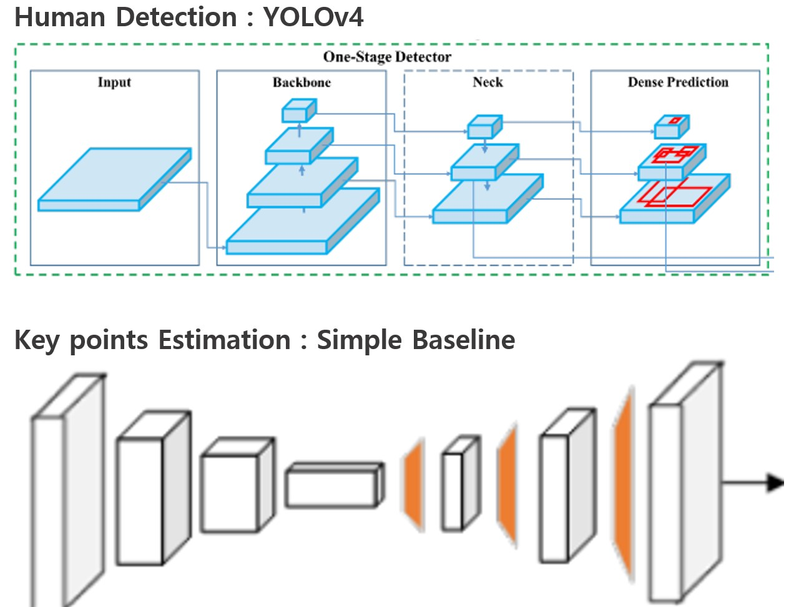
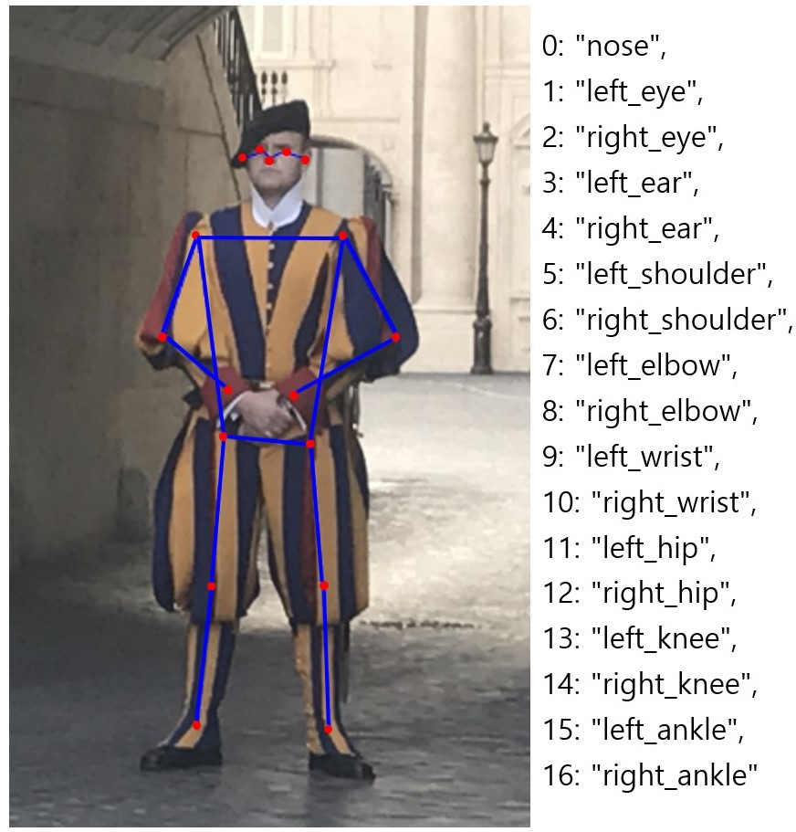

# Top-Down 2D Human Pose Estimation 구현.

## Result

- Human Detection Result
  
- Keypoints Estimation Result
  

## Top-Down 2D Pose Estimation

- Step 1. Human Detection
- Step 2. Body Keypoints Estimation

## Model

- Human Detection : <a href="https://github.com/WongKinYiu/PyTorch_YOLOv4">YoloV4</a>
- Body Keypoints Estimation : <a href="https://github.com/microsoft/human-pose-estimation.pytorch">Simple Baseline </a>

## COCO Keypoints Annotation

